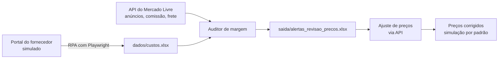

# Auditor de Margem de Lucro + RPA de Custos: Mercado Livre

Automação em Python que protege a margem de um e-commerce no Mercado Livre. Ela cruza os anúncios ativos (via API) com os custos dos fornecedores, avisa quais anúncios estão com margem baixa e sugere o ajuste de preço, tudo em um ciclo único.

<!-- Depois de gravar o GIF da execução, salve em docs/demo.gif e remova as marcas de comentário da linha abaixo -->
<!--  -->

> **Tudo na demonstração é fictício.** O portal do fornecedor é uma **simulação** criada para mostrar o RPA funcionando; os produtos, SKUs, custos e credenciais (`demo` / `demo123`) não existem no mundo real.

---

## O problema

Em um e-commerce de autopeças, o lucro de cada anúncio depende de três valores que mudam:

- a **comissão** do Mercado Livre,
- o **frete grátis** pago pelo vendedor,
- o **custo do fornecedor**.

Se qualquer um deles sobe e o preço de venda não acompanha, a margem some sem ninguém perceber. Este projeto automatiza a checagem:

```
Lucro    = Preço de venda − Comissão ML − Frete do vendedor − Custo do fornecedor
Margem % = Lucro ÷ Preço de venda × 100
```

## O ciclo



| Etapa        | Script                | O que faz                                                                                                                 |
| ------------ | --------------------- | ------------------------------------------------------------------------------------------------------------------------- |
| 1. Custos    | `rpa_custos.py`       | Robô (Playwright) entra no portal do fornecedor, lê a tabela de custos e atualiza o `custos.xlsx` com regras de segurança |
| 2. Auditoria | `auditor_margem.py`   | Busca os anúncios na API, calcula a margem real e gera a lista de anúncios abaixo do mínimo                               |
| 3. Preços    | `atualizar_precos.py` | Leva os anúncios em alerta ao preço sugerido, em modo automático ou assistido                                             |
| Todas        | `ciclo_completo.py`   | Roda as três etapas em sequência com um comando                                                                           |

---

## Demonstração rápida (sem conta do Mercado Livre)

Não precisa de credenciais, token nem `.env`.

```bash
git clone <url-do-repositorio>
cd <pasta-do-projeto>

pip install -r requirements.txt
playwright install chromium

python src/ciclo_completo.py --demo
```

O comando sobe o portal simulado, roda o ciclo inteiro e o encerra em cerca de 10 segundos. Use `--visivel` para ver o navegador do robô trabalhando.

Resultado esperado no final:

```
SKU        Custo (R$)          Margem            Situação
--------------------------------------------------------------
DEMO-001   290,00 → 301,50     19,8% → 17,6%     OK → OK
DEMO-002   235,00 → 236,00     4,1% → 3,8%       ALERTA → ALERTA
DEMO-003   142,00 → 142,00     1,1% → 1,1%       ALERTA → ALERTA
DEMO-004   100,00 → 88,50      -8,0% → 0,2%      ALERTA → ALERTA
DEMO-005   165,00 → 165,00     11,9% → 11,9%     OK → OK
DEMO-006   62,00 → 64,00       -5,6% → -8,4%     ALERTA → ALERTA

⚠️  DEMO-003: custo do portal 205,90 (+45,0%) retido para conferência com o fornecedor.
```

O que a demonstração mostra:

- O robô atualizou 4 custos, deixou 1 sem mudança e **reteve o DEMO-003**, cujo custo subiu 45% (acima do limite de 30%, pode ser erro do fornecedor).
- A margem do DEMO-004 melhorou (custo caiu) e a do DEMO-006 piorou (custo subiu).
- O ajuste de preços sugere um novo valor para os 4 anúncios em alerta, em **simulação** (nada é enviado).
- Os arquivos originais do `demo/` **não são alterados**: o resultado vai para `demo/saida/`.

---

## Estrutura do projeto

```
├── README.md  requirements.txt  .env.example  .gitignore
├── .env  tokens.json            ← seus segredos (fora do Git)
│
├── src/                         ← todo o código
│   ├── ciclo_completo.py        ← ponto de entrada
│   ├── auditor_margem.py
│   ├── rpa_custos.py
│   ├── atualizar_precos.py
│   ├── coletar_anuncios.py      ← funções de coleta (usadas pelo auditor)
│   ├── ml_auth.py               ← autenticação e renovação do token
│   └── gerar_token.py  testar_api.py  testar_frete.py
│
├── dados/                       ← suas entradas reais (fora do Git)
│   ├── custos.xlsx
│   └── .playwright-session/     ← login salvo do robô
│
├── saida/                       ← tudo que o sistema gera (fora do Git)
│   ├── alertas_revisao_precos.xlsx  relatorio_custos.xlsx  resultado_precos.xlsx
│   └── logs/  screenshots/  backups/
│
└── demo/                        ← exemplo versionado
    ├── portal_fornecedor/       ← portal simulado (Flask)
    ├── anuncios_ml.csv  custos.xlsx
    └── saida/                   ← o que a demonstração gera (fora do Git)
```

> Rode os comandos sempre **a partir da raiz** do projeto: o `tokens.json` e os caminhos relativos dependem disso.

---

## Uso real

### 1. Instalação

```bash
pip install -r requirements.txt
playwright install chromium
```

Crie o `.env` na raiz (use o `.env.example` como modelo):

```env
ML_CLIENT_ID=seu_app_id
ML_CLIENT_SECRET=sua_secret_key
ML_REDIRECT_URI=https://www.google.com
```

> O `ML_REDIRECT_URI` precisa ser **idêntico** ao cadastrado no app do Mercado Livre Developers (sem barra no final).

**Configuração do app no painel do Mercado Livre Developers:**

- Fluxos OAuth: **Authorization Code** e **Refresh Token** marcados
- PKCE: desmarcado
- Permissões: _Leitura_ em Publicação e sincronização, Faturamento e Venda e envios de um produto
- Para o ajuste real de preços (opcional): _Leitura e escrita_ em Publicação e sincronização

### 2. Primeira autenticação (uma vez só)

1. Abra o link abaixo em uma aba anônima, logado na conta do vendedor (troque `SEU_APP_ID`):

   ```
   https://auth.mercadolivre.com.br/authorization?response_type=code&client_id=SEU_APP_ID&redirect_uri=https://www.google.com
   ```

2. Clique em **Permitir**. Você será levado ao Google, e a URL terá o código: `https://www.google.com/?code=TG-xxxxxxxx...`
3. Rode o script e cole a URL inteira (ou só o código `TG-...`):

   ```bash
   python src/gerar_token.py
   ```

   Esperado: `✅ Token gerado!` e `Tem refresh_token?: True`.

4. Teste a conexão: `python src/testar_api.py`

> O código `TG-` é de uso único e expira em poucos minutos. Depois disso o token é renovado automaticamente.

### 3. Planilha de custos: `dados/custos.xlsx`

Duas colunas, na primeira aba, com cabeçalho na linha 1:

| SKU     | Custo do Fornecedor |
| ------- | ------------------- |
| ABC-123 | 85,90               |
| XYZ-456 | 210,00              |

- O SKU deve ser **igual** ao do anúncio no Mercado Livre (maiúsculas e minúsculas não importam).
- O mesmo SKU pode se repetir (peça compatível com vários veículos), se o custo for igual.
- Custo aceito como `85.9`, `85,90` ou `R$ 85,90`.

### 4. Rodar

```bash
python src/ciclo_completo.py --sem-custos --precos   # auditoria + ajuste de preços (simulação)
python src/ciclo_completo.py                          # inclui o robô de custos (precisa de um portal)
python src/auditor_margem.py                         # só a auditoria
```

O robô de custos só faz sentido se o seu fornecedor tem um portal web. Se você mantém o `dados/custos.xlsx` manualmente, use `--sem-custos`.

---

## Módulos

### Auditor de margem: `auditor_margem.py`

Busca todos os anúncios ativos, consulta comissão (`/sites/MLB/listing_prices`) e frete do vendedor (`/users/{id}/shipping_options/free`), cruza com os custos e gera `saida/alertas_revisao_precos.xlsx`.

| Aba                    | Conteúdo                                                                                                      |
| ---------------------- | ------------------------------------------------------------------------------------------------------------- |
| **Alertas**            | Anúncios abaixo da margem mínima, do pior para o melhor, com `situacao`, `motivo` e um `preco_sugerido_aprox` |
| **Sem custo ou erro**  | SKUs que não existem no `custos.xlsx` ou anúncios com erro na consulta                                        |
| **Auditoria completa** | Todos os anúncios, com comissão, frete, custo, lucro e margem                                                 |

A coluna `situacao` vale `ALERTA`, `OK`, `SEM CUSTO` ou `ERRO`, e `motivo` explica o alerta (por exemplo, `prejuízo e margem abaixo de 10%`).

Configuração no topo do arquivo: `MARGEM_MIN_PCT` (padrão 10), `LUCRO_MIN_REAIS` (padrão 0) e `LIMITE_TESTE` (processa só N anúncios, útil no primeiro teste).

### RPA de custos: `rpa_custos.py`

Robô com Playwright: faz login, percorre a tabela paginada do portal, converte `R$ 1.234,56` em número e atualiza o `custos.xlsx`.

| Situação                               | O que o robô faz                                      |
| -------------------------------------- | ----------------------------------------------------- |
| Custo igual ao atual                   | **SEM MUDANÇA**                                       |
| Variação de até 30%                    | **ATUALIZADO** (gravado)                              |
| Variação acima de 30%                  | **CONFERIR** (não grava: pode ser erro do fornecedor) |
| Custo ilegível no portal               | **ERRO DE LEITURA** (registra e segue com os demais)  |
| SKU do portal que não está na planilha | Listado como SKU novo, não é adicionado               |
| SKU da planilha que não está no portal | Listado, não é alterado                               |

Opções: `--demo`, `--simular` (compara sem gravar), `--limite 30`, `--visivel`, `--limpar-sessao`.

Segurança e robustez:

- **Backup** com data em `saida/backups/` antes de cada gravação real.
- Só as **células de custo** mudam; formatação e outras abas ficam intactas.
- **Login salvo** em `dados/.playwright-session/`; senha só no `.env` ou digitada no terminal, nunca no código nem no log.
- **Log** em `saida/logs/` e **screenshot automático** em `saida/screenshots/` quando o navegador falha.
- **Seletores centralizados** no dicionário `SELETORES`: se o portal mudar, o ajuste é em um lugar só.

### Ajuste de preços: `atualizar_precos.py`

Lê os alertas e leva cada anúncio ao `preco_sugerido_aprox`, via `PUT /items/{id}`.

- **Modo automático:** aplica o preço sugerido em todos.
- **Modo assistido:** um anúncio por vez; ENTER aceita o sugerido, ou você digita outro preço (`829.90` ou `829,90`), e confirma com `S` / `N` / `C` (cancelar).

Proteções:

- **Simulação por padrão:** nada é enviado ao Mercado Livre sem `--aplicar`.
- `--aplicar` pede para digitar `CONFIRMAR` antes de qualquer alteração.
- No automático, são ignorados os anúncios sem sugestão ou cujo sugerido não aumenta o preço, e **aumentos acima de 50%** ficam para conferência.
- Cada alteração é **confirmada lendo o anúncio de volta** na API.
- `--max N` limita a quantidade de anúncios (use `--max 1` no primeiro teste real).
- Anúncios com variações podem ser recusados pela API: o erro é registrado e o script segue.

```bash
python src/atualizar_precos.py                    # simulação
python src/atualizar_precos.py --aplicar --max 1  # primeiro teste real, com 1 anúncio
```

> ⚠️ A alteração real de preços foi testada apenas com a API simulada em testes automatizados. Valide com `--aplicar --max 1` antes de usar em escala.

---

## Segurança

- **Nunca compartilhe** o `.env`, o `tokens.json` nem a pasta `dados/`.
- Nenhuma credencial fica no código ou nos logs.
- O `.gitignore` deixa de fora os segredos, os dados reais e tudo o que o sistema gera:

  ```
  __pycache__/
  *.pyc
  .env
  tokens.json
  dados/
  saida/
  demo/saida/
  /*.xlsx
  /*.csv
  ```

- A permissão de escrita no app só é necessária para `--aplicar`. A auditoria funciona somente com leitura.

---

## Limitações

- O preço considerado é o de tabela do anúncio; promoções ativas não entram no cálculo.
- O frete é a cotação da API (`list_cost`); confira de vez em quando com o custo real de uma venda recente.
- O `preco_sugerido_aprox` é uma estimativa: ele mantém a taxa de comissão e o frete atuais, e o frete varia conforme o preço.
- O portal do fornecedor é simulado: para um portal real, os seletores em `SELETORES` precisam ser ajustados.

---

## Problemas comuns

| Mensagem / sintoma                                       | O que fazer                                                                                                                                              |
| -------------------------------------------------------- | -------------------------------------------------------------------------------------------------------------------------------------------------------- |
| `invalid_grant` ao gerar o token                         | Código expirado ou já usado, ou `redirect_uri` diferente do cadastrado. Gere outro código                                                                |
| `403 PA_UNAUTHORIZED_RESULT_FROM_POLICIES`               | Falta permissão no app. Libere _Leitura_ em "Venda e envios de um produto", salve e reautorize                                                           |
| `Tem refresh_token?: False`                              | Marque **Refresh Token** no app e refaça a autenticação                                                                                                  |
| `tokens.json` ou arquivos não encontrados                | Rode os comandos a partir da raiz do projeto                                                                                                             |
| `Não consegui iniciar o portal simulado`                 | Veja o erro mostrado no terminal e o log em `saida/logs/portal_demo.log`; verifique Flask instalado e porta 5000 livre (`netstat -ano \| findstr :5000`) |
| `Executable doesn't exist` (Playwright)                  | Rode `playwright install chromium`                                                                                                                       |
| `PermissionError` ao gerar relatórios                    | Feche o arquivo `.xlsx` no Excel                                                                                                                         |
| `Pandas requires version '3.1.5' or newer of 'openpyxl'` | `pip install --upgrade openpyxl`                                                                                                                         |
| `Coluna 'SKU' não encontrada`                            | Ajuste `COL_SKU` e `COL_CUSTO` no topo dos scripts para os nomes da sua planilha                                                                         |
| Muitos itens em "Sem custo ou erro"                      | O SKU do Excel está diferente do anúncio (hífen, espaço, zero à esquerda)                                                                                |
| `sem permissão de escrita` no ajuste de preços           | Habilite _Leitura e escrita_ em "Publicação e sincronização" e reautorize                                                                                |

---

## Decisões de projeto

- **API onde existe, RPA onde não existe.** Anúncios, comissão, frete e preço têm API oficial, que é mais estável do que automatizar a interface. O RPA ficou com o único ponto sem API: o portal do fornecedor.
- **Seguro por padrão.** O robô segura variações suspeitas, faz backup antes de gravar e o ajuste de preços só simula até receber `--aplicar` e a palavra `CONFIRMAR`.
- **Uma falha não derruba a execução.** Um produto ilegível ou um anúncio recusado vira registro no relatório e no log, e os demais seguem.
- **Etapas independentes.** Cada script funciona sozinho; o `ciclo_completo.py` só coordena a ordem.
- **Demonstrável por qualquer pessoa.** O modo `--demo` roda o ciclo inteiro sem conta, sem credenciais e sem alterar os arquivos de exemplo.

## Tecnologias

Python 3.12 · Playwright · pandas · openpyxl · requests · Flask (portal simulado) · API do Mercado Livre (OAuth 2.0)
